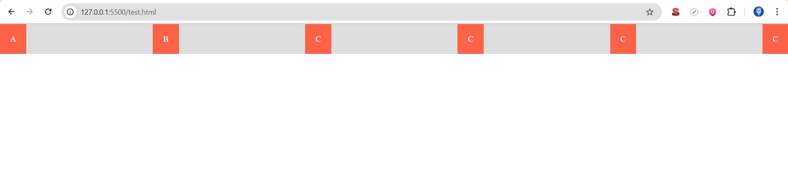
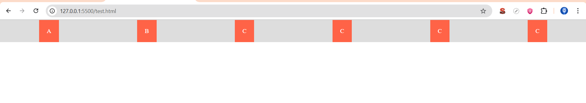
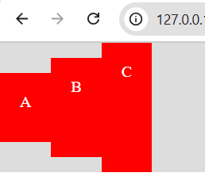
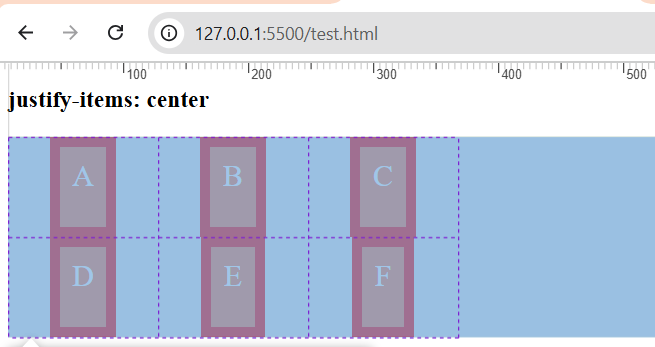
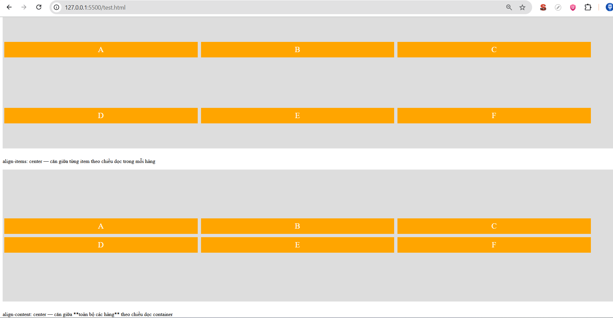

# Next.js Guide - Routing & Data Fetching

## 1. Route trong Next.js

Định nghĩa file `page` trong Next.js sẽ tự động tạo ra route tương ứng với tên file và thư mục trong thư mục `app`.

**Ví dụ:**

```plaintext
app/
├── page.tsx              → route: /
├── about/
│   └── page.tsx          → route: /about
└── blog/
    └── [slug]/
        └── page.tsx      → route: /blog/:slug
```

---

## 2. Lấy giá trị slug trong Next.js

### Client Component

Sử dụng `useParams` hook:

```tsx
import { useParams } from 'next/navigation';

const BlogPost = () => {
  const { slug } = useParams();
  return <div>Blog Post: {slug}</div>;
};

export default BlogPost;
```

### Server Component

Lấy giá trị slug từ tham số hàm:

```tsx
const BlogPost = ({ params }: { params: { slug: string } }) => {
  const { slug } = params;
  return <div>Blog Post: {slug}</div>;
};

export default BlogPost;
```

### Catch-all Routes

```tsx
// app/docs/[...slug]/page.tsx
export default async function DocsPage({ 
  params 
}: { 
  params: Promise<{ slug: string[] }> 
}) {
  const { slug } = await params;
  return <p>Đường dẫn: {slug.join(" / ")}</p>;
}
```

**Example:** Truy cập `/docs/nextjs/routing` → `slug = ['nextjs', 'routing']`

---

## 3. Server Component vs Client Component

### Quy tắc mặc định

- **Bất kỳ component nào trong Next.js đều là Server Component theo mặc định**
- Component có sử dụng hook, event handler, hoặc state → **Client Component** (thêm `"use client"` ở đầu file)
- Component con bên trong Client Component → tự động trở thành Client Component

### Best Practice

Tách riêng Client Component ra file riêng để tránh việc tất cả component con đều trở thành Client Component.

---

## 4. Shared Layout giữa các route

### Cấu trúc thư mục

```plaintext
app/
├── layout.tsx            → layout chung cho tất cả routes
├── about/
│   ├── layout.tsx        → layout riêng cho /about và routes con
│   └── page.tsx
└── blog/
    └── [slug]/
        └── page.tsx
```

### Nội dung Layout

```tsx
export default function Layout({ children }: { children: React.ReactNode }) {
  return (
    <html>
      <body>
        <header>My Website Header</header>
        <main>{children}</main>
        <footer>My Website Footer</footer>
      </body>
    </html>
  );
}
```

---

## 5. API Routes trong Next.js

### Cấu trúc API Routes

```plaintext
app/
└── api/
    └── hello/
        └── route.ts      → route: /api/hello
```

### Định nghĩa API Route

```ts
// app/api/hello/route.ts
import { NextResponse } from 'next/server';

export async function GET() {
  return NextResponse.json({ message: 'Hello, world!' });
}

export async function POST(request: Request) {
  const data = await request.json();
  return NextResponse.json({ receivedData: data });
}
```

### Gọi API từ Client Component

#### GET Request

```tsx
import { useEffect, useState } from 'react';

const ApiExample = () => {
  const [message, setMessage] = useState('');
  
  useEffect(() => {
    fetch('/api/hello')
      .then((res) => res.json())
      .then((data) => setMessage(data.message));
  }, []);
  
  return <div>API Message: {message}</div>;
};

export default ApiExample;
```

#### POST Request

```tsx
import { useState } from 'react';

const PostApiExample = () => {
  const [response, setResponse] = useState(null);
  
  const handlePost = async () => {
    const res = await fetch('/api/hello', {
      method: 'POST',
      headers: { 'Content-Type': 'application/json' },
      body: JSON.stringify({ name: 'Next.js' }),
    });
    const data = await res.json();
    setResponse(data);
  };
  
  return (
    <div>
      <button onClick={handlePost}>Send POST Request</button>
      {response && <pre>{JSON.stringify(response, null, 2)}</pre>}
    </div>
  );
};

export default PostApiExample;
```

### Gọi API từ Server Component

#### GET Request

```tsx
const ServerApiExample = async () => {
  const res = await fetch('http://localhost:3000/api/hello');
  const data = await res.json();
  
  return <div>API Message: {data.message}</div>;
};

export default ServerApiExample;
```

#### POST Request

```tsx
const ServerPostApiExample = async () => {
  const res = await fetch('http://localhost:3000/api/hello', {
    method: 'POST',
    headers: { 'Content-Type': 'application/json' },
    body: JSON.stringify({ name: 'Next.js' }),
  });
  const data = await res.json();
  
  return <div>API Response: {JSON.stringify(data)}</div>;
};

export default ServerPostApiExample;
```

---

## 6. Điều hướng người dùng

### Sử dụng Link Component

```tsx
import Link from 'next/link';

<Link href="/about">Go to About Page</Link>
```

### Sử dụng useRouter Hook (Client Component)

```tsx
import { useRouter } from 'next/navigation';

const MyComponent = () => {
  const router = useRouter();
  
  const handleNavigation = () => {
    router.push('/about');
  };
  
  return <button onClick={handleNavigation}>Go to About</button>;
};
```

---

## 7. Search Params

**Example URL:** `/products?category=shoes&sort=price_asc`

### Client Component

```tsx
import { useSearchParams } from 'next/navigation';

const SearchParamsExample = () => {
  const searchParams = useSearchParams();
  const category = searchParams.get('category');
  const sort = searchParams.get('sort');
  
  return (
    <div>
      <p>Category: {category}</p>
      <p>Sort: {sort}</p>
    </div>
  );
};

export default SearchParamsExample;
```

### Server Component

```tsx
import { NextRequest } from 'next/server';

export async function GET(request: NextRequest) {
  const { searchParams } = request.nextUrl;
  const category = searchParams.get('category');
  const sort = searchParams.get('sort');
  
  return (
    <div>
      <p>Category: {category}</p>
      <p>Sort: {sort}</p>
    </div>
  );
}

export default GET;
```

---

## 8. Thư mục Public

### Cấu trúc

```plaintext
public/
└── logo.png
```

### Sử dụng

```html

```

---

## 9. Route Groups

Sử dụng ngoặc tròn `()` để nhóm các routes mà không ảnh hưởng đến cấu trúc URL.

### Cấu trúc

```plaintext
app/
├── (admin)/
│   ├── layout.tsx        → layout chung cho nhóm admin
│   ├── dashboard/
│   │   ├── layout.tsx
│   │   └── page.tsx
│   └── settings/
│       └── page.tsx
├── layout.tsx            → layout chung
└── page.tsx
```

### Layout kế thừa

Layout của `dashboard` → kế thừa từ layout nhóm `(admin)` → kế thừa từ layout chung

### Example Admin Layout

```tsx
export default function AdminLayout({ 
  children 
}: { 
  children: React.ReactNode 
}) {
  return (
    <html>
      <body>
        <header>Admin Panel Header</header>
        <main>{children}</main>
        <footer>Admin Panel Footer</footer>
      </body>
    </html>
  );
}
```

---

## 10. Server Actions & Revalidation

### Cấu trúc thư mục

```plaintext
app/
├── products/
│   └── page.tsx              → Server Component hiển thị sản phẩm
├── admin/
│   └── api/
│       ├── revalidate-path/
│       │   └── route.ts      → Revalidate path
│       └── revalidate-tag/
│           └── route.ts      → Revalidate tag
└── page.tsx                  → Home page
```

### Server Component với Cache Options

```tsx
// app/products/page.tsx
export default async function ProductsPage({ 
  searchParams 
}: { 
  searchParams: { category?: string } 
}) {
  const category = searchParams.category || "all";

  // 1. Dữ liệu luôn fetch mới (no-store)
  const resNoStore = await fetch(
    `https://api.example.com/products?category=${category}`, 
    {
      cache: 'no-store', // luôn fetch mới
    }
  );
  const dataNoStore = await resNoStore.json();

  // 2. Dữ liệu cache 10 giây (revalidate)
  const resRevalidate = await fetch(
    `https://api.example.com/products?category=${category}`, 
    {
      next: { revalidate: 10 }, // cache 10 giây
    }
  );
  const dataRevalidate = await resRevalidate.json();

  // 3. Dữ liệu với tag (để revalidate theo tag)
  const resTag = await fetch(
    `https://api.example.com/products?category=${category}`, 
    {
      next: { tags: ["products"] }, // gắn tag
    }
  );
  const dataTag = await resTag.json();

  return (
    <div>
      <h2>Products (No Store)</h2>
      <ul>
        {dataNoStore.map((p: any) => (
          <li key={p.id}>{p.name}</li>
        ))}
      </ul>

      <h2>Products (Revalidate 10s)</h2>
      <ul>
        {dataRevalidate.map((p: any) => (
          <li key={p.id}>{p.name}</li>
        ))}
      </ul>
      
      <h2>Products (Tagged)</h2>
      <ul>
        {dataTag.map((p: any) => (
          <li key={p.id}>{p.name}</li>
        ))}
      </ul>
    </div>
  );
}
```

### Server Action: revalidatePath

```ts
// app/admin/api/revalidate-path/route.ts
import { revalidatePath } from "next/cache";

export async function POST() {
  revalidatePath("/products"); // xóa cache page /products
  return new Response("Path /products revalidated!");
}
```

### Server Action: revalidateTag

```ts
// app/admin/api/revalidate-tag/route.ts
import { revalidateTag } from "next/cache";

export async function POST() {
  revalidateTag("products"); // xóa cache tất cả fetch có tag 'products'
  return new Response("Tag 'products' revalidated!");
}
```

---

## 11. router.refresh()

Trong Next.js App Router (13+), `router.refresh()` sẽ làm mới (re-fetch) dữ liệu và server component của route hiện tại, tương tự như tải lại trang.

### Sử dụng

```tsx
import { useRouter } from 'next/navigation';

const MyComponent = () => {
  const router = useRouter();
  
  const handleRefresh = () => {
    router.refresh(); // Làm mới route hiện tại
  };
  
  return <button onClick={handleRefresh}>Refresh Data</button>;
};
```

---

## Tổng kết

Tài liệu này cung cấp các khái niệm và pattern cơ bản trong Next.js App Router:

- ✅ Routing & Dynamic Routes
- ✅ Server vs Client Components
- ✅ Layouts & Route Groups
- ✅ API Routes
- ✅ Navigation
- ✅ Data Fetching & Caching
- ✅ Revalidation Strategies

Happy coding! 🚀
## 12. Màn hình trong Tailwind CSS

| Class prefix | Áp dụng khi màn hình ≥ | Ví dụ sử dụng    |
| ------------- | ---------------------- | ---------------- |
| `sm:`         | 640px                  | `sm:text-lg`     |
| `md:`         | 768px                  | `md:w-1/2`       |
| `lg:`         | 1024px                 | `lg:grid-cols-3` |
| `xl:`         | 1280px                 | `xl:p-10`        |
| `2xl:`        | 1536px                 | `2xl:max-w-7xl`  |

## 13. Các hình ảnh minh họa Flexbox

- Trong CSS, **width** của một `div` mặc định là `100%` (lấy theo cha), còn **height** thì lại lấy theo con dài nhất.
- Theo mặc định, chiều cao của mỗi hàng trong Flexbox sẽ bằng với chiều cao của phần tử cao nhất trong hàng đó.
- **Lưu ý:** Khi có 2 hàng, `align-items` sẽ căn từng item theo từng hàng nó đang ở.

### Space-between


### Space-around


### Align-items: căn giữa theo chiều dọc, căn theo div cha


### Justify-items: chỉ dùng được trong Grid layout, căn chỉnh theo chiều ngang của mỗi frame


### Align-content: khi có 2 hàng, nó căn giữa toàn bộ các hàng theo chiều dọc container

# CSS Position Absolute và Flexbox - Tài liệu quan trọng

## 14. Hành vi của Position Absolute trong Flex Container

### Câu hỏi
Trong một cấu trúc:
- Div cha: `position: relative`, `display: flex`, `justify-content: center`
- Div con: `position: absolute`
- **CHƯA** set `top` và `left`

❓ **Vị trí của div con có bị ảnh hưởng bởi `justify-content: center` không?**

### Câu trả lời
✅ **CÓ** - Div con `absolute` vẫn bị ảnh hưởng bởi `justify-content: center` của div cha.

---

## Giải thích chi tiết

Khi một phần tử có `position: absolute` mà **chưa set** `top`, `left`, `right`, `bottom`:

1. **Vẫn nằm trong flow layout ban đầu**
   - Phần tử vẫn chịu ảnh hưởng của flexbox
   - Vị trí được tính toán dựa trên flex alignment

2. **Không chiếm không gian thực tế**
   - Các phần tử khác sẽ xếp như thể nó không tồn tại
   - Không đẩy các phần tử khác đi

---

## Demo Code

### Case 1: Chưa set top/left (Ăn theo flex)
```html
<div style="
  position: relative; 
  display: flex; 
  justify-content: center; 
  border: 2px solid blue; 
  padding: 20px;
">
  <div style="
    position: absolute; 
    background: red; 
    padding: 10px;
  ">
    Div absolute (chưa set top/left)
  </div>
</div>
```

**Kết quả:** ✅ Div con sẽ nằm ở **giữa** theo `justify-content: center`

---

### Case 2: Đã set top/left (Thoát khỏi flex)
```html
<div style="
  position: relative; 
  display: flex; 
  justify-content: center; 
  border: 2px solid blue; 
  padding: 20px;
">
  <div style="
    position: absolute; 
    top: 0; 
    left: 0; 
    background: red; 
    padding: 10px;
  ">
    Div absolute (đã set top/left)
  </div>
</div>
```

**Kết quả:** ❌ Div con bỏ qua flex và căn theo **góc trên-trái** của div cha `relative`

---

## So sánh trực quan

| Trường hợp | Vị trí | Ảnh hưởng của flex | Positioning context |
|------------|--------|-------------------|---------------------|
| **Chưa set top/left** | Giữa container | ✅ CÓ | Flex layout |
| **Đã set top/left** | Theo tọa độ chỉ định | ❌ KHÔNG | Relative parent |

---

## Kết luận quan trọng

### ✅ Chưa set top/left
- Vẫn **ăn theo flex layout**
- Chịu ảnh hưởng của `justify-content`, `align-items`
- Vị trí dựa trên flex alignment

### ❌ Đã set top/left  
- **Thoát khỏi flex** hoàn toàn
- Căn theo positioning context (nearest positioned ancestor)
- Không còn chịu ảnh hưởng của flex properties

---

## Ứng dụng thực tế

### Pattern 1: Center absolute element dùng flex
```css
.parent {
  position: relative;
  display: flex;
  justify-content: center;
  align-items: center;
}

.child {
  position: absolute;
  /* Không set top/left - sẽ tự động center */
}
```

### Pattern 2: Absolute positioning chính xác
```css
.parent {
  position: relative;
  display: flex; /* Không ảnh hưởng */
}

.child {
  position: absolute;
  top: 20px;
  left: 20px;
  /* Bỏ qua flex, căn theo parent */
}
```

---

## Lưu ý

⚠️ **Quan trọng:**
- Hành vi này chỉ xảy ra khi **chưa set bất kỳ offset nào** (top/left/right/bottom)
- Ngay khi set **một offset bất kỳ**, phần tử sẽ thoát khỏi flex flow hoàn toàn
- Đây là điểm dễ gây nhầm lẫn nhất khi kết hợp `position: absolute` với flexbox

---

**Ngày cập nhật:** 2025  
**Trạng thái:** Production-ready documentation
### 14. Bảng Tailwind

| Tailwind class | rem      | px    |
| -------------- | -------- | ----- |
| `text-xs`      | 0.75rem  | 12px  |
| `text-sm`      | 0.875rem | 14px  |
| `text-base`    | 1rem     | 16px  |
| `text-lg`      | 1.125rem | 18px  |
| `text-xl`      | 1.25rem  | 20px  |
| `text-2xl`     | 1.5rem   | 24px  |
| `text-3xl`     | 1.875rem | 30px  |
| `text-4xl`     | 2.25rem  | 36px  |
| `text-5xl`     | 3rem     | 48px  |
| `text-6xl`     | 3.75rem  | 60px  |
| `text-7xl`     | 4.5rem   | 72px  |
| `text-8xl`     | 6rem     | 96px  |
| `text-9xl`     | 8rem     | 128px |